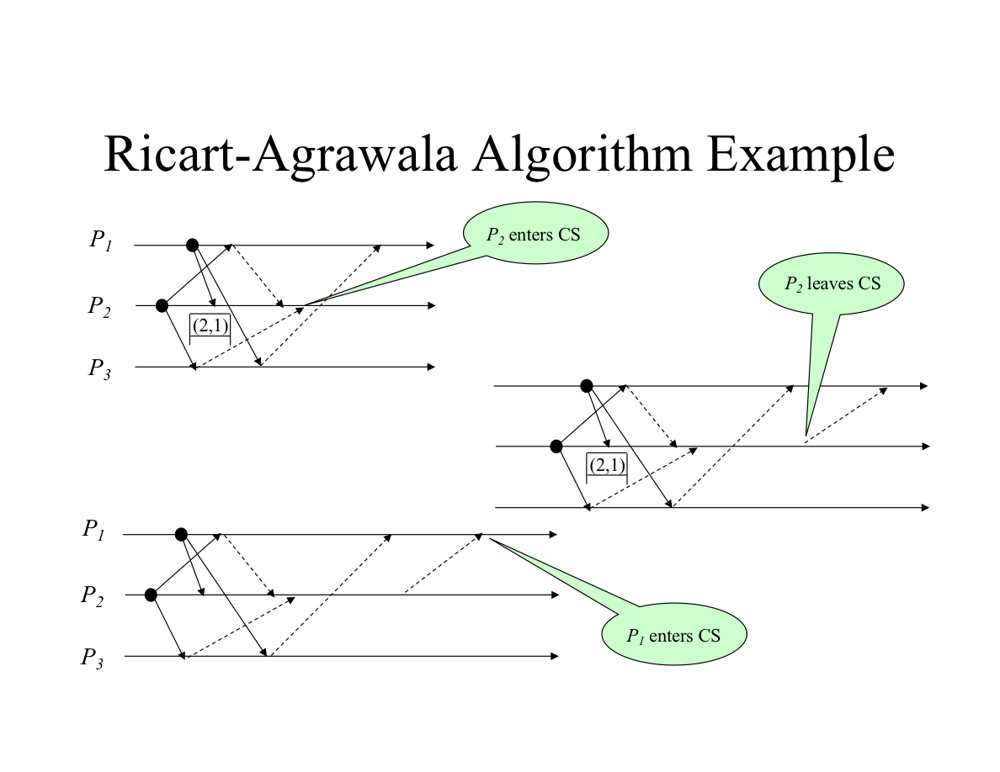

## Ricart–Agrawala Algorithm for Mutual Exclusion in Distributed System

Mutual exclusion in distributed systems is a property for data concurrency. It prevents processes in distributed systems from accessing shared resources concurrently to prevent race conditions. It is a requirement that a process cannot enter its critical section while another concurrent process is currently present or executing in its critical section; in other words, only one process is allowed to execute the critical section at any given instance of time.

Some of the interesting use cases for it are database systems, distributed transaction processing, and file-sharing systems.

